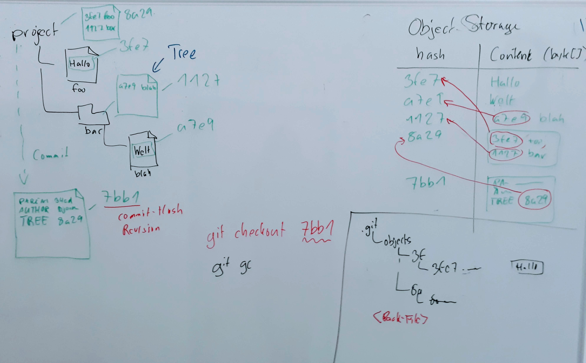

### Lernziel (Befehle)

```bash
    # Commits erstellen
    git status
    git diff
    git commit

    # Änderungen hinzufügen (Staging,Index)
    git add
    git commit -a

    # Commits mit Tags markieren
    git tag

    # Oops!
    git stash
    git revert
```

---

### Begriff: `HEAD`

`HEAD` bezeichnet die vorige Version.

(von vorigem `commit`, oder `checkout`)

```bash
git show HEAD
```

---


### `git status`

zeigt, was im Workspace los ist:

  * Welches ist der *aktive Branch*?
  * Wurden Dateien (bezogen auf `HEAD`)
    - gelöscht?
    - bearbeitet?
    - neu angelegt?
  * Außerdem: Mergekonflikte, Synchr.-Status

Notes:

 * Verzeichnisse werden zusammengefasst
 * Außerdem Änderungen bezogen auf HEAD oder Index

---

### Tipp

Vor wichtigen Operationen,

immer checken, ob der Status *clean* ist:

```bash
    $ git status
      ...
    nothing to commit, working tree clean
```

Notes:

 * Hinweise auf stash
 * TODO Hinweis auf Prompts

---

### Aktiver Branch

 * Ein Branch ist ein Zeiger auf ein Commit
 * (max.) 1 Branch ist aktiv
 * Default `master`
 * Neues Commit: Zeiger des aktiven Branches wird aktualisiert.


---


## `git commit`

 * Erstellt ein neues Commit
 * Setzt `HEAD` auf den neue Commit
 * Setzt den aktiven Branch auf das neue Commit


---


### Commit - geänderte Dateien

Einzelne Datei:

    git commit <file>

Alle geänderen Dateien, die bereits versioniert sind.

    git commit -a

Und gleich mit Message:

    git commit -am "Edit some files."


---


### Commit - neue Dateien

Neue Dateien werden beim `commit -a` nicht automatisch übernommen. Sie müssen zunächst angemeldet werden.

    git add <file>

    git add <dir>

    git add .

Dann Commit, wie gehabt.

    git commit


---

### Commit - gelöschte Dateien

    rm my-file # Oder über file explorer

Löschungen werden bei `-a` übernommen:

    git commit -am 'deleted my-file'

Es gibt auch einen Git-Befehl zum Löschen:

    git rm my-file
    git commit -am 'deleted my-file'


---


Git kann Verschiebungen von Dateien erkennen (*Rename Detection*).

Wie geht das?


---

Wenn in einem Commit,

 * eine Datei gelöscht wurde,
 * und eine neue Datei hinzugekommen ist, und
 * die Inhalte (fast) gleich sind,
 
geht Git davon aus, dass eine Datei verschoben wurde.

Die Option `--follow` am `log`-Befehl forciert die *rename detection*.


---


### Commit - Verschieben von Dateien

   mv hallo hello       
   git add .
   git commit -m "hallo -> hello"
   
Die Historie von `hello`:

   git log --follow -- hello
   
   

---


###  Tipp: Separate move from change

 1. Move
 1. Commit
 1. Change
 1. Commit


---


Commit Trees




---

Was genau ist in einem Commit enthalten?

    git log --pretty=raw


---

## Verzeichnisse

Verzeichnisse werden in Git nicht explizit versioniert.

Ein Verzeichnis muss mindestens eine Datei enthalten.

Ggf. legt man ein hidden File an, z. B. `.gitkeep`


---

### Übung 02: Commits erstellen

Starten sie im *Übungsverzeichnis* (wo sie das Zip-Archiv mit den
Übungen entpackt haben).
Öffnen sie die Anleitung im *Browser* (mit dem Kommando `start` auf
Windows, `xdg-open` auf Ubuntu,`open` auf MacOs).
**Achtung!** Es ist wichtig, die Übungen im *angegebenen
Startverzeichnis* zu beginnen. Achten Sie auf die Beschreibung:

    $ cd git-uebungen-<Zeitstempel z. B. 202005252000>
    $ start aufgaben/02-commits-erstellen/index.html 
    $ cd aufgaben/<angegebenes Startverzeichnis>

Folgen Sie dann den weiteren Anweisungen.


---


## Der *Stage*-Bereich 

(aka *Index*)

Git sammelt Änderungen im Stage-Bereich.
`git add` "parkt" sie dort,
bis sie in einem Commit verwendet werden.

    Workspace   -add->   Stage   -commit->   Repository

d.h. wenn ändert man Dateien nach dem `add`,
werden diese beim Commit noch nicht übernommen.


Notes:

Im "Grundzustand" enspricht die Stage dem HEAD-Stand


---


### Tipps zum Staging

Unterschied zwischen Workspace und Stage:

    git diff

Unterschied zwischen Workspace und Stage:

    git diff --staged

Setzt Stage auf den `HEAD`-Stand zurück:

    git restore --staged <file>

Setzt Workspace auf den Stage-Stand zurück:

    git restore <file>


---


---

## Tags

    git tag v0.1.7


---

### Oops - Unterbrechung!

Angefangene Änderungen kann man jeder zeit mit `stash` wegsichern.

    git stash
    git stash -u
    git stash --all
    git stash -m "bugfix started"
    git stash pop


---

### Oops - fehlerhaftes Commit


    revert  HEAD~3


---


### Oops - versehentlich geändert

Vorsicht: Dateien werden überschrieben!

Datei versehentlich geändert

    git checkout HEAD -- foo

Alte Version einer Datei wieder herstellen

    git checkout HEAD~3 -- foo

Ganzen Workspace zurücksetzen

    git stash -u

