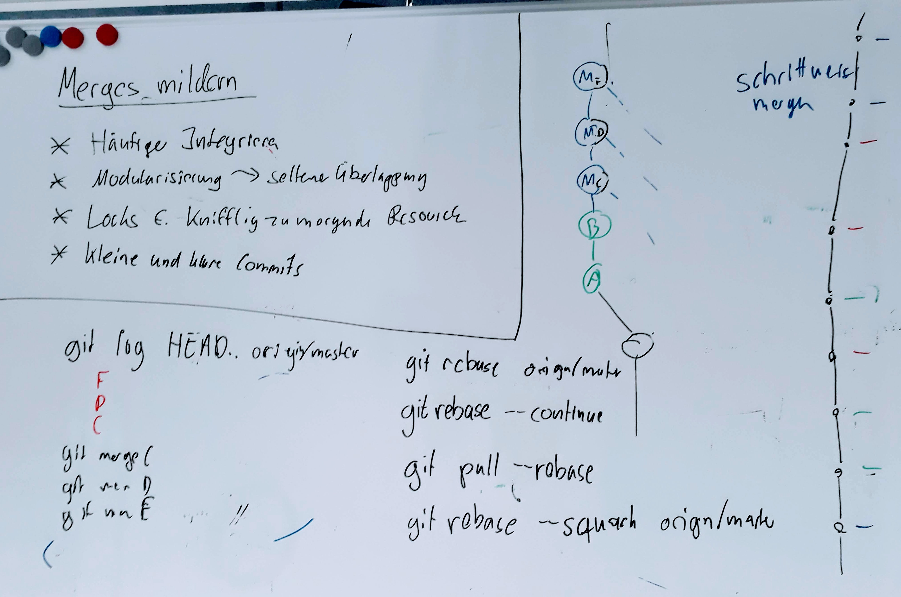

# Merges

---


## Lernziel


 * Commit-Graph
   - `master` vs. `origin/master`
 * 3-Wege-Merge
 * Mergekonflikte
   - `HEAD` | `MERGE_HEAD`
 * Fast-Forwards

---

### Lernziel (Befehle)


```bash
  git log --all --graph

  git merge

  git mergetool

  git log branchA..branchB
  git log HEAD^1..HEAD^2
```


---

### Wie entstehen Verzweigungen im Commit-Graphen?

 1. Zwei Entwickler A und B klonen ein Repository
 1. Beide erstellen ein Commit
    (mit dem selben Vorgänger)
 1. B pushed zuerst (und gewinnt!)
 1. A versucht zu pushen, aber ...

---


--------------------------------------------------

### Push rejected

> Grundregel: Nie Historie vernichten!

Alle Commits, die vorher in der Historie des Branches waren, müssen es nachher auch noch sein.

Technisch: Beim Push muss das neue Commit Nachfahre des Vorherigen sein!

-> Der Konflikt muss jetzt lokal aufgelöst werden!

---

### Merge

    git fetch

    git merge origin/master

---

### 3-Wege-Merge


---

### Eigenschaften des Merge

Aus dem Merge entsteht idR. ein Commit:

 * Commit hat 2 Parents (mind.)
 * 3-Wege-Merge
   * Alle Änderungen seit dem Common-Ancestor werden zusammengeführt
   * Textabschnitte (Hunks) werden hinzugefügt, geändert oder gelöschtt.
   * Keinerlei Garantie, dass Änderungen zusammenpassen!
 * Das Merge Commit kann frei bearbeitet werden (`--no-commit`, dann manuelles commit)


---

### Merge und Diff

Die "Stimmgabel"

    git diff HEAD^1
    git diff HEAD^2

Welches Diff ich sehe, hängt davon ab, von wo ich schaue.

---

### Merge - Fast Forward


Wenn sich auf einer Seite des Merges nichts getan hat, macht Git idR. ein *fast-forward*:

---


---


    git merge --no-ff

    git merge --ff-only

 `fast-forward` 34


---

### Merge - Konflikt

       - `config --global merge.conflictStyle diff3`
       - Konflikte 41
       - `checkout` 38
       - `--ours`, `--theirs` 32
       - `merge --abort`
       - `mergetool` 32

`merge` 29,30,31,43,44

---



---

Wenn man einem Merge per `revert` rückgängig macht,
       muss man dieses später mit einem weiteren `revert` rückgängig machen,
       um die Änderungen zu reaktivieren

---


---


[Renames und Merges](renames-und-merges.md)


