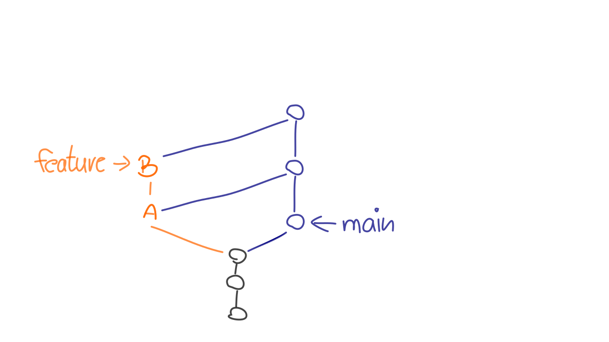
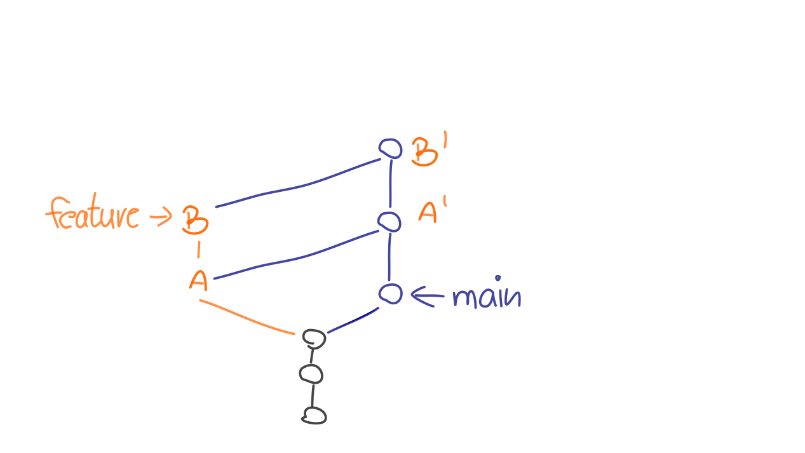
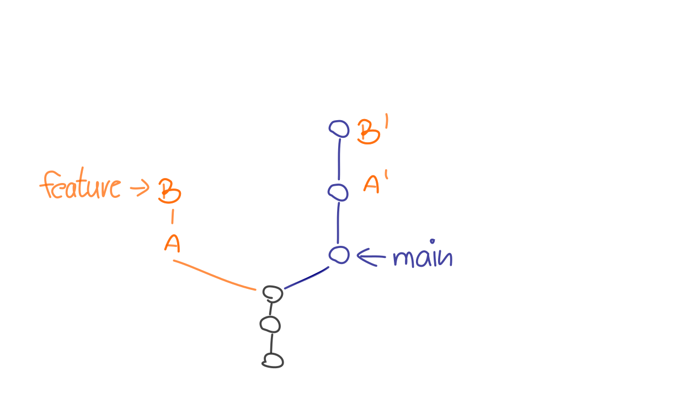

# Rebasing

---

## Lernziele

```
    rebase / rebase --interactive
```

 * Rebasing **dupliziert Commits**
 * **Risiken** und Nebenwirkungen
 * **Interaktives Rebasing**

---

### Rebase und Merge sind verwandt


---

Merge und Rebase sind enge Verwandte:

---


---



---



---



---


---

### Rebase Beispiel 1


---

### Rebase Beispiel 2


---

### Rebase - Anwendung

    git rebase newbase

Welche Commits? Wohin?

 * Die neuen Commits entstehen auf `newbase`
 * Dupliziert werden
   - HEAD..newbase
   - Alle Commits in HEAD, die noch
     nicht in newbase enthalten sind

Ohne Parameter: Upstream Branch.

    git rebase

---

### Rebase - Konflikte

 * theirs vs. ours

---

### Übung: Rebasing

Starten sie im *Übungsverzeichnis* (wo sie das Zip-Archiv mit den
Übungen entpackt haben).
Öffnen sie die Anleitung im *Browser* (mit dem Kommando `start` auf
Windows, `xdg-open` auf Ubuntu,`open` auf MacOs).
**Achtung!** Es ist wichtig, die Übungen im *angegebenen
Startverzeichnis* zu beginnen. Achten Sie auf die Beschreibung:

    $ cd git-uebungen-<Zeitstempel z. B. 202005252000>
    $ start xdg-open aufgaben/XX-rebasing-rebasing/index.html
    $ cd aufgaben/<angegebenes Startverzeichnis>

Folgen Sie dann den weiteren Anweisungen.


---


## Risiken und Nebenwirkungen

### Probleme mit duplizierten Commits

### (Un-)sichtbarkeit von Integrationen

---


### Verwandte Befehle

 * `commit --amend`
 * `reset HEAD~1`
 * `cherry-pick`
 * `filter-branch`


