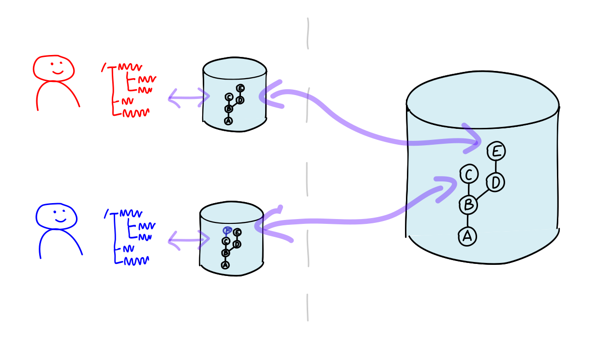

## Achitektur von Git

---

Zentral

---

Dezentral

Git kann Deltas zwischen Repos übertragen (`push`/`pull`/`fetch`).

---

Dezentral, mit *blessed repo*.

---

### Git

 * hat *keine* Client/Server-Architektur,
 * besteht aus Kommandozeilenbefehlen (*CLI*),
 * speichert Daten in Dateien und Verzeichnissen
   (*Object Store*).

---

## Wie macht man Software erweiterbar?

---

Git setzt auf [Porcelaine & Plumbing](https://git-scm.com/book/en/v2/Git-Internals-Plumbing-and-Porcelain), statt auf Plugins.

---

* `plumbing`
  - elementar
  - Datenstrukturen auslesen/bearbeiten
* `porcelaine`
  - komfortabel, leistungsfähige
  - z. B. `log`, `commit`, `merge`, ... 
  - basieren auf `plumbing`
* auch `plumbing` ist 
  - standardisiert
  - ermöglicht Erweiterungen

---

## Kann Software eine Meinung haben?

---

## Git 

 * ist nicht *opinionated*,
 * bietet eine Viefalt an Befehlen,
 * ermöglicht unterschiedliche Workflows und Arbeitsweisen.

---

## Abwärtskompatibilität

Die Git-Community legt starken Wert auf **abwärtskompatibilität**.

Dies erleichtert einerseits Scripting/Automatisierung.

Andererseits können *alte Zöpfe* nicht abgeschnitten werden.

---

 * **dezentral** \
   Kein Server/Service/Dämon. \
   Nur Kommandos, die mit Dateien arbeiten.
 * **CLI** + Dateistrukturen
 * **"Porcelaine & Plumbing"**
   - Plumbing: "Rohe" Befehle, Dateiformate
   - Porcelaine: Komfortable End-User-Befehle
 * nicht **opinionated** \
   unterstützt unterschiedlichste Workflows \
   ohne Präferenz für *richtigen Workflow*
 * **Abwärtskompatibilität**
