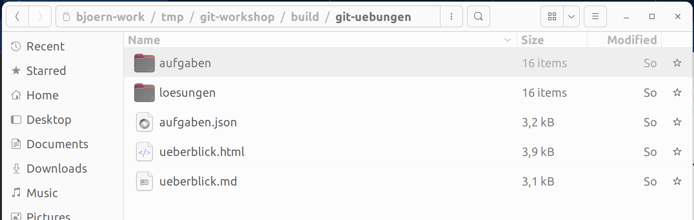

### Die Git Kommandozeile


---


Falls noch nicht geschehen:

[Git installieren](/git-workshop/installation/git)


---


## Terminal/Shell

Für die Übungen wird ein Terminal/Shell-Fenster benötigt

 * Linux/Mac: "Terminal" öffnen
 * Windows: "Git-Bash" öffnen

Tipp: Sie können auch mit anderen Shell arbeiten, z.B PowerShell oder zsh.
Übungen und Musterlösungen wurden in der Bash-Shell getestest bzw. aufgezeichnet.


---


[Tipps zum Arbeiten mit der Kommandozeile](/git-workshop/installation/kommandozeile)


---


## Git Befehle

```
    git <sub-command> <options> <arguments>
```

z.B.
```bash
    $ git commit -a -m "Hallo Welt!"

    $ git version
    git version 2.37.3
```

---


## Hilfe und Infos zu Git

 ```
 $ git
 $ git --version
 $ git help
 $ git help log
 $ git help --all
 $ git help --guides
 $ git help revisions
 ```

---

### Befehl: `git config`

```bash
  $ git config user.name               # Konfiguration ausgeben
  bjoern

  $ git config --global user.name      # Konfiguration ändern
```

[Git konfigurieren](/git-workshop/installation/konfigurieren)

---

Konfigurationsempfehlungen für diesen Workshop:

```bash
    $ git config --global user.email <Ihre-Email>
    $ git config --global user.name <Ihr-Name>
    $ git config --global pull.rebase false 
    $ git config --global merge.conflictStyle diff3
```

---


[Übungen herunterladen und entpacken](/git-workshop/installation/uebungen)




---


### Übung

<h2><a href="markdown-git-uebungen/aufgabe-intro-setup.html" target="_blank">Das Git-Kommando<a></h2>


