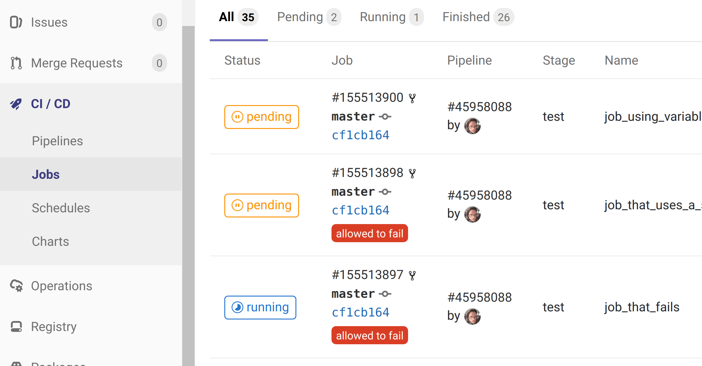

# **Jobs**

---

## Lernziel

 * `.gitlab-ci.yml`
 * Was ist ein GitLab-Job?
 * Wie konfiguriert man einen Job?

---

### ` .gitlab-ci.yml`

 * beschreibt die Pipeline.
 * besteht aus Jobs,\
   die das Projekt bauen, testen, deployen etc.
 * Sobald ein Commit ankommt*\
   führt GitLab die Pipeline aus.
 * [Einsteigertipps zur YAML-Syntax](https://github.com/Animosity/CraftIRC/wiki/Complete-idiot's-introduction-to-yaml)

Notes:

*: Andere Startbedingungen können konfiguriert werden.

---

---

## Job

Ein Job führt seine Arbeit in Form von Kommandozeilenbefehlen aus:

https://gitlab.com/gitlab-ci-samples/basic-job

---

## Job - Optionen und Umgebung

Es gibt zahlreiche Möglichkeiten zu steuern, ob, wann, wo und wie die Kommandos ausgeführt werden.

 * [Doku zu `.gitlab-ci.yml`](https://docs.gitlab.com/ee/ci/yaml/)

 * https://gitlab.com/gitlab-ci-samples/job-options

Zahlreiche vordefinierte Variablen geben Zugriff auf den Kontext:

https://docs.gitlab.com/ee/ci/variables/

