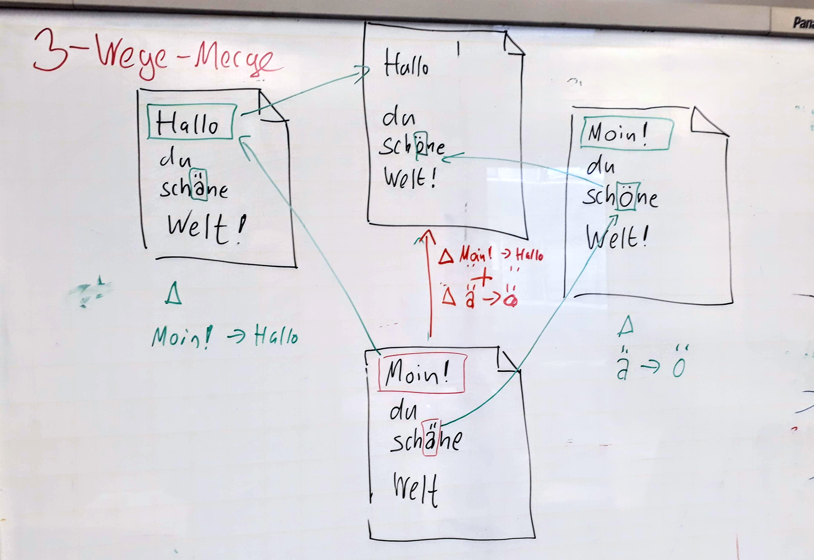

# Merges

---


## Learning Goals


 * Commit-Graph
   - `master` vs. `origin/master`
 * 3-Wege-Merge
 * Merge conflicts
   - `HEAD` | `MERGE_HEAD`
 * Fast-Forwards

---


### Lerning Goals (Commands)


```bash
  git log --all --graph

  git merge

  git mergetool

  git log branchA..branchB
  git log HEAD^1..HEAD^2
```


---

### Branches just happen

 1. Two developers A and B clone a repository
 1. Both create a commit
    (with the same parent)
 1. B pushes first (and wins!)
 1. A tries to push, but ...

---


--------------------------------------------------


### Push rejected


> 1. Rule of pushing: \
> Don't destroy history!

All commits, that were part of the history before,
shall be part of the history after.

Technically this implies, that the previous head of
the branch, must be an ancestor of the upcoming head.

You will have to resolve the conflicts locally, 
before pushing successfully.


---


> A commit is needed, \
> that has both histories \
> in its ancestry.


---


### Merge

```bash
    git fetch

    git merge origin/master
```

---


### 3 Way Merge




---


## 3-Way-Merge

 * Both parents will bei compared to the *latest common ancestor*, aka
`merge-base`.
 * Text snippets that differ from the merge-base are called *Hunks*.
 * Git will try to apply all Hunks to create a merged version.
 * If Hunks overlap, git will signal a conflict.

---


### More about the merge

 * (at least) 2 parents
 * The merge commit can be edited freely (use `--no-commit` and commit later)
 * There is absolutely no guarantee that the merged version is consistent!


---


### Merge and Diff

The "Fork"

    git diff HEAD^1
    git diff HEAD^2

> Which diff i see, \
> depends on where i stand.

---

### Merge - Fast Forward


If only the other side has changes,
no merge commit is created,
and the current branch will be set to the merged commit.

This is called **fast forward**.


---


---


---


---


    git merge --no-ff

    git merge --ff-only

 `fast-forward` 34


---

### Merge Conflict

       - `config --global merge.conflictStyle diff3`
       - Konflikte 41
       - `checkout` 38
       - `--ours`, `--theirs` 32
       - `merge --abort`
       - `mergetool` 32

`merge` 29,30,31,43,44


---


---


[Renames und Merges](renames-und-merges.md)


