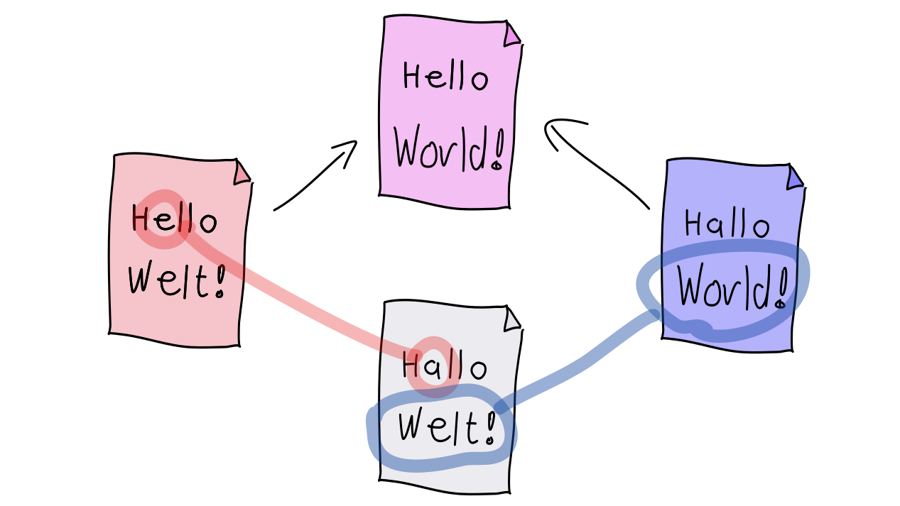

## Wie entstehen Verzweigungen?

---

### Wie entstehen Verzweigungen im Commit-Graphen?

 1. Zwei Entwickler A und B klonen ein Repository
 1. Beide erstellen ein Commit
    (mit dem selben Vorgänger)
 1. B pushed zuerst (und gewinnt!)
 1. A versucht zu pushen, aber ...

---


---

### Merge

    git fetch

    git merge origin/master

---

## 3-Wege-Merge


---


---


---


---





---

### Eigenschaften des Merge

Aus dem Merge entsteht idR. ein Commit:

 * Commit hat 2 Parents (mind.)
 * 3-Wege-Merge
   * Alle Änderungen seit dem Common-Ancestor werden zusammengeführt
   * Textabschnitte (Hunks) werden hinzugefügt, geändert oder gelöscht.
   * Keinerlei Garantie, dass Änderungen zusammenpassen!
 * Das Merge Commit kann frei bearbeitet werden (`--no-commit`, dann manuelles commit)


---


## Änderungen 

### automatisch zusammengeführt
 
 * verschiedene Dateien
 * verschiedene Zeilenbereichen einer Datei

### als Konflikt gemeldet

 * verschiedene Zeilenbereichen einer Datei


---


```bash
   $ git status
``` 
zeigt, um welche Dateien es geht.

```
  Unmerged paths:
    (use "git add <file>..." to mark resolution)
          both modified:   average.kts
```

---


In den betroffenen Dateien stehen dann
Konfliktmarker.


```
  <<<<<<< HEAD
  val summe = args.map{ it.toInt() }.sum()
  ||||||| d19e196
  val s = args.map{ it.toInt() }.sum()
  =======
  val s = args.map{ it.toDouble() }.sum()
  >>>>>>> 04781863ba5f6ffe3303c84d463546043a932e5
```
*(Ausnahme: Binärdateien)*

---

## Konflikt auflösen

1. `git status` zeigt Konfliktdateien
1. Für jede Konfliktdatei
   1. Datei öffnen, Konfliktmarker sucehn
   1. Zeilen manuell zusammenführen
   1. Konfliktmarker löschen
   1. `git add <file>` zum Bestätigen
1. Mit `git commit` abschließen

## Alternativ

```bash
 $ git mergetool
```

---

### Merge und Diff

Die "Stimmgabel"

    git diff HEAD^1
    git diff HEAD^2

Welches Diff ich sehe, hängt davon ab, von wo ich schaue.


### Merge - Fast Forward


Wenn sich auf einer Seite des Merges nichts getan hat, macht Git idR. ein *fast-forward*:

---


---


---


---


    git merge --no-ff

    git merge --ff-only

 `fast-forward` 34


---

### Merge - Konflikt

       - `config --global merge.conflictStyle diff3`
       - Konflikte 41
       - `checkout` 38
       - `--ours`, `--theirs` 32
       - `merge --abort`
       - `mergetool` 32

`merge` 29,30,31,43,44


---

### Übung

<h2><a href="markdown-git-uebungen/aufgabe-zusammenarbeit-integration-von-aenderungen.html" target="_blank">Integration von Änderungen<a></h2>

---


**Merge-Konflike** können anstrengend sein. Was kann man tun, um sie

### zu vermeiden?

### weniger schlimm zu machen?

### leichter lösen zu können?


---


 * klare Modularsierung, Architektur
 * Abstimmung (Wer macht was?)
 * häufige Integration
 * Schritt zurück, Änderungen analysieren, Intention erkennen
 * Kommunikation vorab, oder Autoren fragen
 * Commit-Kommentare
 * schrittweises Mergen
 * fein granulare Commits
 * gute Merge-Tools


---


---


[Renames und Merges](renames-und-merges.md)


---

### Zusammenfassung (Befehle)

```bash
  git log --all --graph

  git merge

  git mergetool

  git log branchA..branchB
  git log HEAD^1..HEAD^2
```


