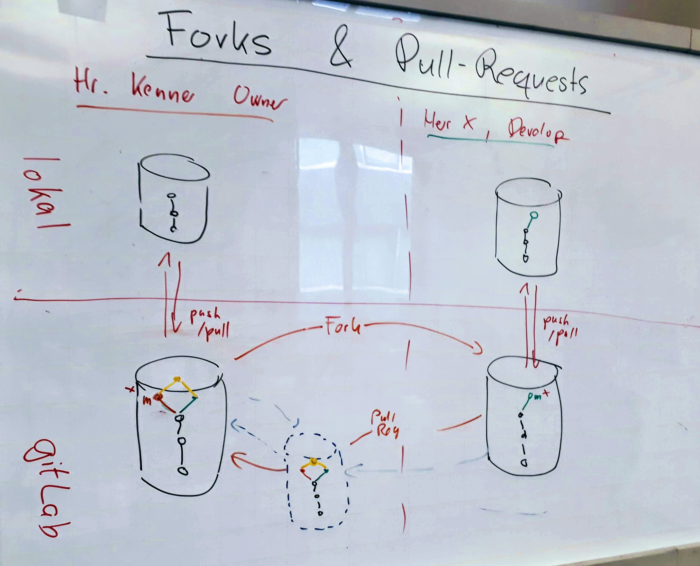

# Pull-Requests

---

## Lernziel

 * Integration von Qalitätssichernden Maßnahmen
 * Pull-Request-Ablauf
 * Demo in GitHub, GitLab & Co.

---

### Pull-Requests

---

# Pull-Requests mit Reviews

 * Forks 68
 * GitHub, GitLab & Co. 35
 * Pull-Request 57,58,59

