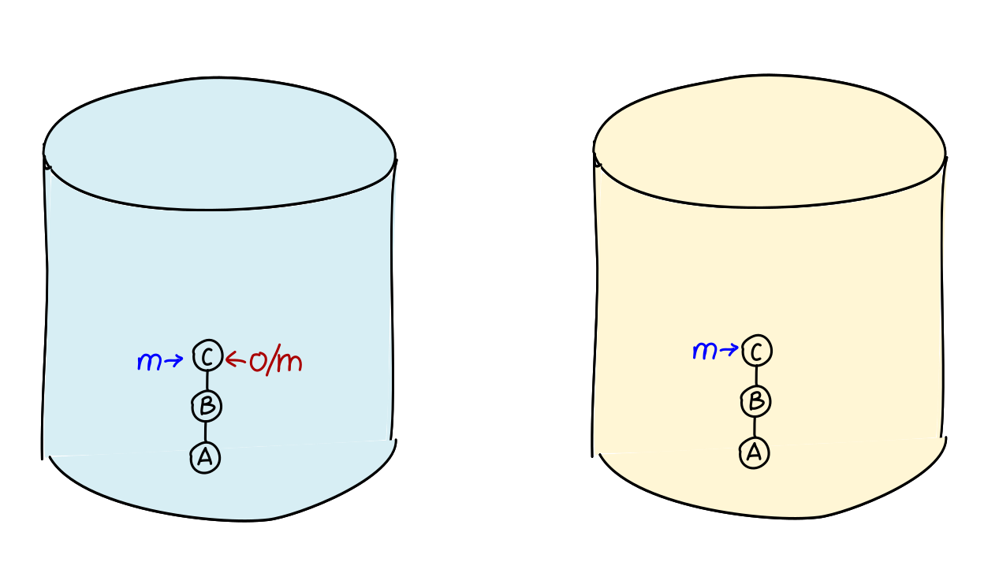
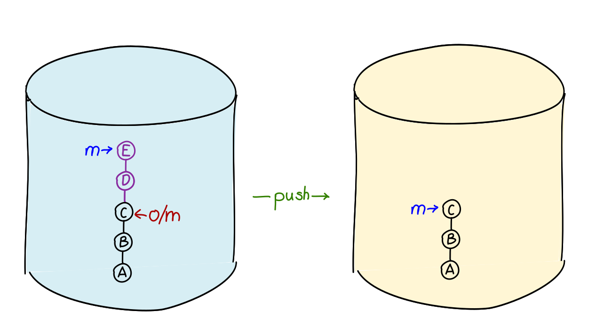
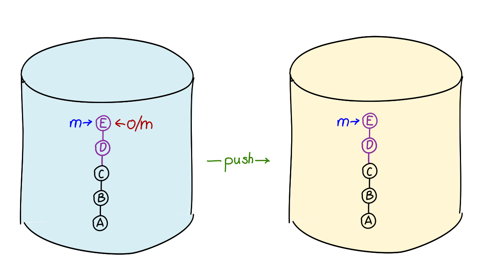

### Lernziel (Befehle)

```bash
    git fetch
    git pull
    git push
```


---

### Synchronisation

```bash
    git fetch      # remote -> lokal
    git push       # lokal -> remote
```


Delta-Übertragung

   1. Vergleicht Remote-Ref mit aktuellem Stand
   1. Ermittelt fehlende Commits, Trees und Blobs und überträgt diese Objekte
   1. Aktualisiert Remote-Refs

Notes:

Man kann auch mit unrelated Repos synchen.


---


Wie funktioniert die Synchronisation?


---


Nach dem Klone ist alles gleich.




---

Neue Commits sollen per `push` übertragen werden.




---

Commits wurden übertragen und Refs aktualisiert.




---

### Push

#### Übertragt vom *aktiven Branch* zum Remote Repository.

```bash
git push
```

Oder genauer:

```bash
git push origin master
```

Achtung: `origin master` (Remote + lokaler branch) nicht `origin/master`

---

### Fetch

#### Holt *alle Branches* vom Remote Repository.

Synchronisiert und aktualisiert Remote-Refs.

Workspace und aktiver Branch bleiben unverändert.

```bash
    git fetch
    git fetch origin
```


---

### Pull

Ein Kombi-Befehl

```bash
git pull
```

 1. Änderungen holen (`git fetch`)
 1. Änderungen im aktuellen Branch übernehmen \
    (`git merge`, nächstes Kapitel).

---


### Übung: Push, Fetch und Pull

Starten sie im *Übungsverzeichnis* (wo sie das Zip-Archiv mit den
Übungen entpackt haben).
Öffnen sie die Anleitung im *Browser* (mit Kommando `start` auf Windows,
`xdg-open` auf Ubuntu,`open` auf MacOs).
**Achtung!** Es ist wichtig, die Übungen im *angegebenen
Startverzeichnis* zu beginnen. Achten Sie auf die Beschreibung:


    $ cd git-uebungen-<Zeitstempel z. B. 202005252000>
    $ start aufgaben/XX-klone-push-fetch-und-pull/index.html
    $ cd aufgaben/<angegebenes Startverzeichnis>

Folgen Sie dann den weiteren Anweisungen.


---

### Push rejected

---


[Push Reject](repo-push-rejected.svg)


--- 


--- 

### Push rejected


> Grundregel: Nie Historie vernichten!

Alle Commits, die vorher in der Historie des Branches waren, müssen es nachher auch noch sein.

Technisch: Beim Push muss das neue Commit Nachfahre des Vorherigen sein!

-> Der Konflikt muss jetzt lokal aufgelöst werden!


---


### Übung: Push rejected!

Starten sie im *Übungsverzeichnis* (wo sie das Zip-Archiv mit den
Übungen entpackt haben).
Öffnen sie die Anleitung im *Browser* (mit Kommando `start` auf Windows,
`xdg-open` auf Ubuntu,`open` auf MacOs).
**Achtung!** Es ist wichtig, die Übungen im *angegebenen
Startverzeichnis* zu beginnen. Achten Sie auf die Beschreibung:

    $ cd git-uebungen-<Zeitstempel z. B. 202005252000>
    $ start aufgaben/XX-klone-push-rejected/index.html
    $ cd aufgaben/<angegebenes Startverzeichnis>

Folgen Sie dann den weiteren Anweisungen.
