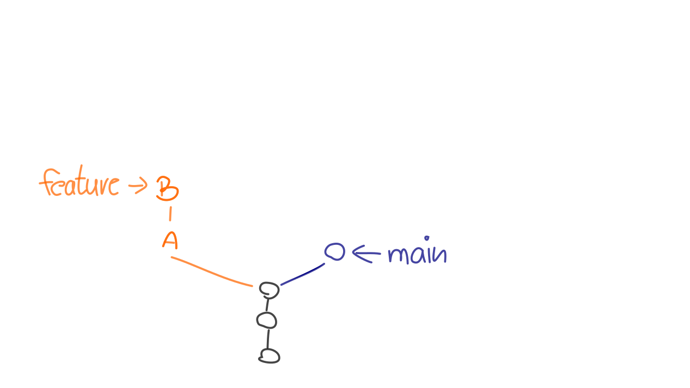
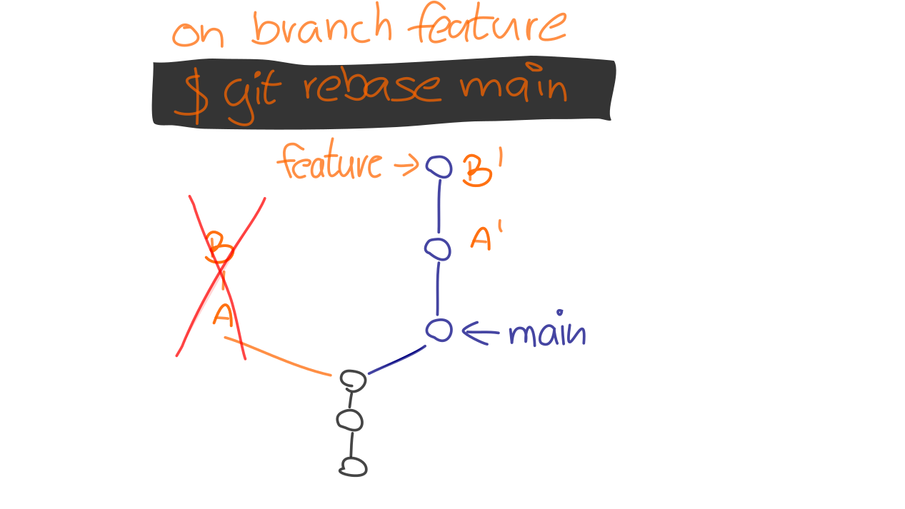

# Rebasing

---

## Lernziele

```
    rebase / rebase --interactive
```

 * Rebasing **dupliziert Commits**
 * **Risiken** und Nebenwirkungen
 * **Interaktives Rebasing**

---

Merge und Rebase sind enge Verwandte:

---



---


---


---


---



---

### Rebase Beispiel 1


---

### Rebase Beispiel 2


---

### Rebase - Anwendung

    git rebase newbase

Welche Commits? Wohin?

 * Die neuen Commits entstehen auf `newbase`
 * Dupliziert werden
   - HEAD..newbase
   - Alle Commits in HEAD, die noch
     nicht in newbase enthalten sind

Ohne Parameter: Upstream Branch.

    git rebase

---

### Rebase - Konflikte

 * theirs vs. ours


---


### Übung

<h2><a href="git-uebungen/aufgabe-zusammenarbeit-rebasing.html" target="_blank">Rebasing<a></h2>


---


## Risiken und Nebenwirkungen

### Probleme mit duplizierten Commits

### (Un-)sichtbarkeit von Integrationen

---


### Verwandte Befehle

 * `commit --amend`
 * `reset HEAD~1`
 * `cherry-pick`
 * `filter-branch`


